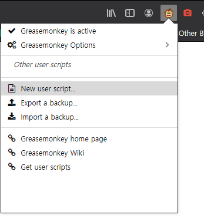
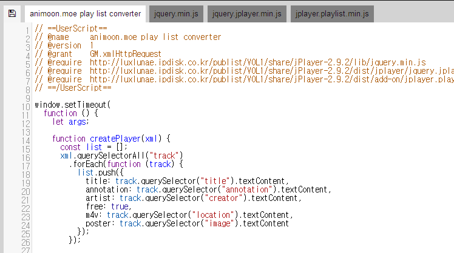

# [Greasemonkey] 오래된 플래시 플레이리스트를 HTML 플레이어로 불러오는 스크립트입니다.

Firefox 86.0.1에서 작동을 확인하였습니다.

## 사용법:

1. Greasemonkey를 설치하기.

   > Greasemonkey: https://addons.mozilla.org/en-US/firefox/addon/greasemonkey/

2. 아래 animoon_flv_video_loader.js 열기.

   > [animoon_flv_video_loader.js](app/animoon_flv_video_loader.js)

3. Greasemonkey로 새 user script 생성

   

4. 2의 소스코드 복사 붙여넣기하기.

   

5. enjoy

## 버전 기록

- 23.2.23 완결작 대응

- 21.3.18 일부 시리즈물 리스트 대응 업데이트

- 21.3.13 첫 출시